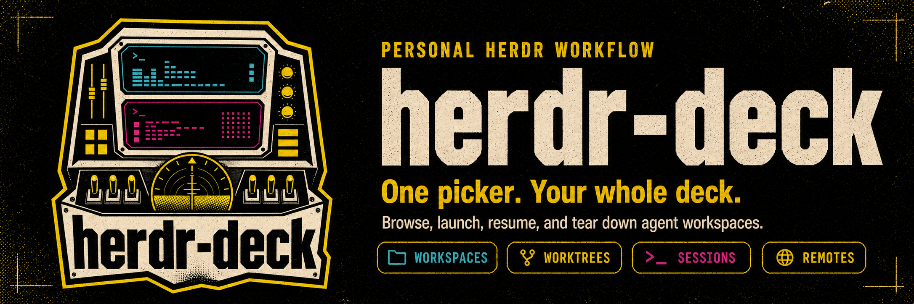

<p align="center">
  
</p>

# herdr-deck

An opinionated deck manager for [herdr](https://herdr.dev): one picker to browse,
launch, and tear down agent workspaces bound to git worktrees.

herdr-deck runs inside a herdr pane and drives everything by shelling out to the
`herdr` and [`wt` (worktrunk)](https://github.com/max-sixty/worktrunk) CLIs.
No daemon, no async runtime, one small binary.

> [!IMPORTANT]
> This is my personal workflow extracted into a public binary, not a generic
> Herdr workspace manager. The picker is reusable; the deck it builds is
> deliberately coupled to my nvim, agent, and terminal setup. Read
> [Requirements and compatibility](#requirements-and-compatibility) before
> installing.

```
╭─ herdr-deck [projects] ─╮╭──────────────────── dotfiles/main ────────────────────╮
│> dot▌             3 / 42││ nvim                         │ codex                  │
╰─────────────────────────╯│                              │                        │
╭──────── Results ────────╮│                              │                        │
│> ● dotfiles/main        ││──────────────────────────────┴────────────────────────│
│  ● dotfiles/ratatui-ux  ││ zsh                                                   │
│  ▸ ~/dotfiles.wt/...    ││                                                       │
╰─────────────────────────╯╰───────────────────────────────────────────────────────╯
```

## What it does

- **Browse**: live herdr workspaces first (agents blocked on you sort to the
  top), then worktrunk worktrees, then your zoxide directories. Type to
  filter. The preview shows a live 2D thumbnail of each workspace's actual
  pane layout, or worktree status (branch, merge state, dirty flags), or a
  directory listing.
- **Remotes**: set `HERDR_DECK_REMOTES` to a comma/space-separated list of ssh
  aliases and each remote herdr server becomes an entry (`⇄`); Enter opens a
  `herdr --remote` thin client in its own terminal window, leaving the local
  session alone (running it inside a pane would nest herdr in herdr).
- **Open**: Enter on a live workspace focuses it. Enter on a worktree or
  directory opens a launch form: pick an agent (detected from your PATH,
  using herdr's known-agent list), optionally name a branch (the worktree is
  created via `wt switch` if needed), and go. herdr-deck builds a deck
  workspace: editor + agent pane + full-width terminal + a lazygit tab.
- **Resume**: `ctrl-s` switches to a separate session-history source, so past
  conversations never pollute workspace/path search. Type searches the first
  prompt and project path; Tab filters by agent. Claude, Codex, and Pi sessions
  resume in a recreated deck rooted at the session's original directory.
  Cursor opens its native session picker in that deck because its CLI does
  not expose an enumerable local history store.
- **Create**: `ctrl-n` prompts for a new directory. A new worktree in an
  existing repo is just Enter on the repo plus the branch field.
- **Destroy**: `ctrl-d` closes a workspace, or removes a worktree — but only
  when its branch is merged (worktrunk's `integrated`/`empty` state); an
  unmerged worktree gets an explicit force-remove confirmation instead.
  Removed paths are purged from zoxide.

## Looking for something less opinionated?

Try [Herdr Navigator](https://github.com/thanhdat77/herdr-navigator). It is a
configurable Herdr plugin that fuzzy-searches workspaces, agents, projects,
sessions, remotes, directories, and actions. Sources can be disabled, custom
command/JSON integrations can be added without changing Rust, and missing
optional tools degrade quietly.

The distinction is mostly intent: Herdr Navigator helps you **jump to
anything**; herdr-deck recreates **my particular working deck** around the
thing you selected.

## Requirements and compatibility

### Minimum

- [Herdr](https://herdr.dev), with `herdr-deck` launched from inside a Herdr
  session. It talks directly to Herdr's socket CLI and exits otherwise.
- A Unix-like environment. The core local workflow is intended for macOS or
  Linux; shell command construction and agent discovery assume Unix paths and
  process behavior.
- `git` for repository detection, branch labels, and worktree-aware behavior.
- `nvim` for every deck launch. It is not optional: the editor pane always
  runs `nvim`.
- The CLI for whichever agent you select, available on `PATH`. Herdr's direct
  agent integrations are strongly recommended so status indicators work.

Rust and Cargo are needed only to build from source. Installing the binary
does not install or configure any of the tools below.

### Feature dependencies

| feature | dependency | behavior when missing |
|---|---|---|
| linked-worktree create/remove | [worktrunk](https://github.com/max-sixty/worktrunk) (`wt`) | ordinary directory decks still work; worktree actions and status do not |
| directory discovery | `zoxide` and/or `fd` | that source becomes sparse or empty |
| directory preview | `eza`, with `ls` fallback | falls back to plain `ls -la` |
| git tab | `lazygit` | the tab is still created, but its command fails |
| Claude deck | Claude Code + [claudecode.nvim](https://github.com/coder/claudecode.nvim) + compatible nvim glue | nvim opens, but Claude does not auto-start |
| Codex deck | Codex CLI + [ishiooon/codex.nvim](https://github.com/ishiooon/codex.nvim) + compatible nvim glue | nvim opens, but Codex does not auto-start |
| saved sessions | agent-owned local history files | only histories found at the supported hardcoded locations appear |
| remote entries | macOS `open` + Ghostty | remote launch is unavailable on other terminals/platforms |

Saved-session discovery currently reads `~/.claude/projects`,
`~/.codex/sessions`, and `~/.pi/agent/sessions`. Cursor exposes discovery only
through its own picker, so herdr-deck opens `cursor-agent ls`. These are
agent-owned storage formats and may change underneath herdr-deck.

### Editor-integrated agent decks

> [!WARNING]
> Claude and Codex are not launched directly by the binary. herdr-deck starts
> nvim with the contract below and expects nvim to establish the IDE connection
> before creating the agent pane. Without compatible nvim glue, the workspace
> opens with an editor and terminal but no Claude/Codex pane.

| agent | variable | value set by herdr-deck |
|---|---|---|
| Claude | `HERDR_DECK_AGENT` | `claude` |
| Claude | `HERDR_DECK_CLAUDE_ARGS` | the dangerous-mode flag when enabled, plus `--resume ID` for a saved session |
| Codex | `HERDR_DECK_AGENT` | `codex` |
| Codex | `HERDR_DECK_CODEX_ARGS` | the dangerous-mode flag when enabled, or `resume ID` plus that flag for a saved session |

This ordering is intentional: both plugins create an editor-side server and
pass connection variables to the agent process. Starting the CLI independently
at the same time as nvim introduces a race and can leave the agent running with
no IDE connection.

#### Claude Code: what the Herdr adapter adds

[`claudecode.nvim`](https://github.com/coder/claudecode.nvim) supplies the
WebSocket IDE server, selection helpers, and native diff protocol. A compatible
herdr-deck configuration must extend it in several Herdr-specific ways:

1. Call `require("claudecode").setup()` first, then consume
   `HERDR_DECK_AGENT` and `HERDR_DECK_CLAUDE_ARGS`.
2. Inside Herdr, use claudecode.nvim's external terminal provider. Its callback
   must create a right split beside the editor and attach every environment
   variable supplied by the plugin (including its SSE port and IDE flags) to
   that new pane. The command should run only after the pane's interactive shell
   is ready. Outside Herdr, retain the plugin's normal in-nvim terminal.
3. Resolve the Claude belonging to this nvim by IDE-port/process identity, with
   same-tab geometry only as a fallback. Matching any Claude in the workspace is
   unsafe when several decks are open.
4. Override focus and selection/diagnostic sending for the external pane with
   `herdr agent focus` and `herdr agent send`. Diff accept/revert still travels
   through claudecode.nvim's WebSocket connection.
5. On an nvim restart, avoid spawning a duplicate agent. The surviving Claude
   may need `/ide` or a rebuilt deck to connect to the new editor server.

Minimal auto-start logic looks like this, but by itself uses whichever terminal
provider you configured; it does **not** recreate the sibling-pane behavior:

```lua
require("claudecode").setup(opts)
if vim.env.HERDR_DECK_AGENT == "claude" then
  vim.schedule(function()
    vim.cmd("ClaudeCode " .. (vim.env.HERDR_DECK_CLAUDE_ARGS or ""))
  end)
end
```

My full adapter is maintained in the dotfiles source at
[`nvim/lua/plugins/claudecode.lua`](https://gitlab.com/ctbaum/dotfiles/-/blob/main/nvim/.config/nvim/lua/plugins/claudecode.lua).
It currently assumes `jq`, `pgrep`, `ps`, `grep`, `sed`, `tr`, `sh`, and a zsh
prompt that contains `➜`. Those are dependencies of this reference adapter,
not of the herdr-deck binary.

#### Codex: what the Herdr adapter adds

[`ishiooon/codex.nvim`](https://github.com/ishiooon/codex.nvim) already supplies
an MCP/WebSocket server, editor tools, selection/file mentions, diagnostics, and
native diff review. It also exposes a custom terminal-provider interface, so the
Herdr layer can remain local configuration rather than a plugin fork:

1. Call `require("codex").setup()` first, then open
   `require("codex.terminal")` with `HERDR_DECK_CODEX_ARGS` when
   `HERDR_DECK_AGENT=codex`.
2. Implement a terminal provider whose `open` method creates the right-hand
   Herdr split and attaches the plugin-provided environment table. It must also
   implement focus/toggle/close against the real Herdr pane rather than tracking
   the short-lived split launcher process.
3. Associate the agent with this nvim by matching `CODEX_CODE_SSE_PORT` in the
   Codex process environment to the editor server port, then reading that
   process's `HERDR_PANE_ID`. Use same-tab geometry only before MCP connects.
4. Let codex.nvim continue handling selection, files, diagnostics, and diffs
   through MCP; the provider is responsible only for terminal lifecycle.

Minimal auto-start logic, again without the Herdr sibling-pane provider:

```lua
require("codex").setup(opts)
if vim.env.HERDR_DECK_AGENT == "codex" then
  vim.schedule(function()
    require("codex.terminal").open({}, vim.env.HERDR_DECK_CODEX_ARGS)
  end)
end
```

My full custom provider is maintained at
[`nvim/lua/plugins/codex.lua`](https://gitlab.com/ctbaum/dotfiles/-/blob/main/nvim/.config/nvim/lua/plugins/codex.lua).
It uses `pgrep`, `ps`, `grep`, `sed`, `tr`, and `sh` for connection-true pane
identity.

### Environment variables

| variable | direction | purpose |
|---|---|---|
| `HERDR_DECK_AGENT`, `HERDR_DECK_CLAUDE_ARGS`, `HERDR_DECK_CODEX_ARGS` | herdr-deck → workspace | editor-agent/nvim startup contract described above |
| `HERDR_DECK_REMOTES` | user → herdr-deck | comma/space-separated SSH aliases shown as remote entries |
| `HERDR_NAV_PASSTHROUGH_RE` | user → navigation plugin | lets `ctrl-j/k` reach herdr-deck when using seamless pane navigation |
| `HERDR_*` | Herdr → processes | inherited session/socket identity; scrubbed only when opening a remote Ghostty window |

### Safety defaults

The launch form starts with **dangerous mode enabled**. Claude, Codex, Cursor,
Devin, Droid, Kimi, OpenCode, Kilo, Hermes, Qoder CLI, and other known agents
receive their built-in bypass/yolo flag or environment override when one is
known. Disable the toggle before launching to omit it. Review `src/ext.rs`
before using this on a machine or repository where that default is not
acceptable.

## Install

Straight from GitHub (no clone needed):

```sh
cargo install --git https://github.com/ctbaum/herdr-deck
```

Or from a clone:

```sh
git clone https://github.com/ctbaum/herdr-deck
cd herdr-deck
cargo install --path .
```

Either way the binary lands in `~/.cargo/bin` (make sure that's on your
PATH). Then bind it in `~/.config/herdr/config.toml`:

```toml
[[keys.command]]
key = "prefix+o"
type = "pane"
command = "herdr-deck"
```

herdr-deck exits when its pane loses focus, so the temporary pane never sticks
around.

## Keys

| key | action |
|-----|--------|
| type | filter (esc clears) |
| `↵` | focus workspace / open remote window / launch form / resume session |
| `ctrl-s` | switch projects / past sessions source |
| `tab` / `shift-tab` | sessions: cycle agent filter |
| `ctrl-n` | new directory, then launch form |
| `ctrl-d` | close workspace / merge-gated worktree remove |
| `ctrl-r` | reload |
| `ctrl-j/k` | move selection (needs passthrough, see below) |
| `?` | help |
| `esc` | back / quit |

If you use a herdr Ctrl-hjkl pane-navigation plugin (e.g.
vim-herdr-navigation), add `herdr-deck` to its passthrough list so `ctrl-j/k`
reach the picker:

```sh
export HERDR_NAV_PASSTHROUGH_RE='^(tv|lazygit|herdr-deck)$'
```

## Opinionated setup and compatibility

herdr-deck mirrors my own personal workflow and layout:

- the deck layout is fixed: editor top-left, agent top-right, terminal
  bottom, lazygit on a new unfocused tab;
- `claude` and `codex` are special-cased to start through nvim and their IDE
  plugins, using the environment contract above;
- the "dangerous" toggle knows each agent's own yolo mechanism (flag or env)
  from a built-in table, and is **on by default**; unknown agents get no toggle;
- remote entries spawn their window via macOS `open` + Ghostty, hardcoded.

In practical terms: without nvim, deck launch is broken; without lazygit,
the git tab is empty; without the matching Claude/Codex nvim glue, those
decks contain only nvim; and selecting an agent normally launches it with
its unsafe/yolo mode enabled. These are current design choices, not graceful
optional paths.

Worktrees are recognised structurally — any directory whose `.git` is a
file (a linked git worktree) — so any worktrunk `worktree-path` layout
works.

If any of these bite you, open an issue — making them configurable is the
obvious next step.
