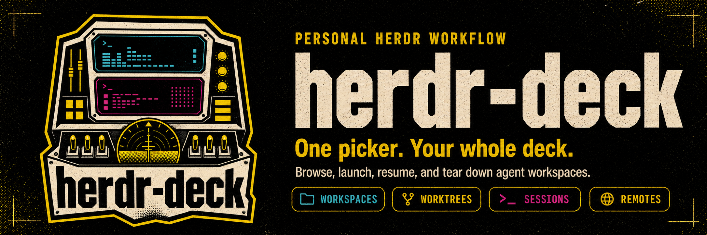

<p align="center">
  
</p>

# herdr-deck

The companion workspace launcher for
[herdr-agents.nvim](https://github.com/ctbaum/herdr-agents.nvim): choose a
project, Git worktree, or saved Claude/Codex session and open it as a ready-made
[Herdr](https://herdr.dev) deck with Neovim, a connected agent, a shell, and
lazygit.

herdr-deck runs inside a Herdr pane and drives everything by shelling out to the
`herdr` and [`wt` (worktrunk)](https://github.com/max-sixty/worktrunk) CLIs.
herdr-agents.nvim keeps Claude or Codex connected to the editor; herdr-deck
recreates the whole workspace around that integration. A small detached Neovim
daemon preserves each open editor while the Herdr server is stopped.

> [!IMPORTANT]
> This is my personal workflow extracted into a public binary, not a generic
> Herdr workspace manager. The picker is reusable; the deck it builds is
> deliberately coupled to my Neovim, agent, and terminal setup. Read
> [Requirements and compatibility](#requirements-and-compatibility) before
> installing.

## Demo

<video src="https://github.com/user-attachments/assets/76b12347-9811-4f1f-902d-ff5972f6cb67" controls muted width="100%"></video>

## What it does

- **Browse**: live Herdr workspaces first (agents blocked on you sort to the
  top), then your zoxide directories organized by project: each Git project's
  root checkout leads, its linked worktrees follow, projects never interleave,
  and plain directories come last. Paths inside a checkout (`project/server`)
  are never suggested. Type to filter. The preview shows a live 2D thumbnail
  of each workspace's actual pane layout, or worktree status (branch, merge
  state, dirty flags), or a directory listing.
- **Remotes**: set `HERDR_DECK_REMOTES` to a comma/space-separated list of SSH
  aliases and each remote Herdr server becomes an entry (`⇄`); Enter opens a
  `herdr --remote` thin client in its own terminal window, leaving the local
  session alone. Running it inside a pane would nest Herdr in Herdr.
- **Open**: Enter on a live workspace focuses it. Enter on a worktree or
  directory opens a launch form: pick an agent (found on your `PATH` from
  Herdr's known-agent list), choose an existing repository worktree from the
  checkout suggestions, or enter a new branch or Worktrunk
  shortcut (`^`, `-`, `@`, `pr:N`, `mr:N`, or a PR/MR URL), and go.
  Worktrunk creates or resolves the checkout, runs its lifecycle hooks, and
  returns its path to herdr-deck. The resulting deck is an editor + agent pane
  + full-width terminal + lazygit tab.
- **Quick toggle**: the native plugin tracks workspace focus events and exposes
  `herdr-deck.toggle-project`, which switches directly between the two most
  recently visited projects without opening the picker.
- **Open agent file links**: when installed as a native Herdr plugin, Ctrl-click
  a linked `path/to/file:line` or `file://` URL in agent output to open it in
  that deck's existing Neovim pane. Each editor has a workspace-specific RPC
  listener; no second Neovim process is created.
- **Survive server restarts**: each deck editor runs in a detached Neovim
  process. After `herdr server stop` and a later server start, the native plugin
  reattaches the original pane to that process, preserving unsaved buffers,
  windows, tabs, extmarks, and plugin state. Claude or Codex is then resumed in
  a replacement pane through the surviving editor's IDE server.
- **Resume**: `ctrl-s` switches to a separate session-history source, so past
  conversations never pollute workspace/path search. Type searches the first
  prompt and project path; Tab filters by agent. Claude, Codex, and Pi sessions
  resume in a recreated deck rooted at the session's original directory.
  Cursor opens its native session picker in that deck because its CLI does
  not expose a queryable local history store.
- **Create**: `ctrl-n` prompts for a new directory. A new worktree in an
  existing repo is just Enter on the repo plus the branch field.
- **Destroy**: `ctrl-d` closes a workspace, or removes a worktree, but only
  when its branch is merged (worktrunk's `integrated`/`empty` state); an
  unmerged worktree gets an explicit force-remove confirmation instead.
  Removed paths are purged from zoxide.
- **Clean up**: `ctrl-g` opens a separate cleanable-worktree source containing
  every integrated/empty linked worktree found through the known repositories.
  Clean entries show `✓`; integrated worktrees with staged, modified,
  untracked, renamed, or deleted files show `!` and are never included in
  batch removal. Filter the review list if desired, then `ctrl-x` removes all
  visible clean entries after one count-and-project confirmation. Every entry
  is revalidated immediately before removal and no force flags are used.

## Looking for something less opinionated?

Try [Herdr Navigator](https://github.com/thanhdat77/herdr-navigator). It is a
configurable Herdr plugin that fuzzy-searches workspaces, agents, projects,
sessions, remotes, directories, and actions. Sources can be disabled, custom
command/JSON integrations can be added without changing Rust, and missing
optional tools degrade quietly.

The distinction is intent: Herdr Navigator helps you **jump to anything**;
herdr-deck recreates **my particular working deck** around the workspace,
session, worktree, or directory you selected.

## Requirements and compatibility

### Minimum

- [Herdr](https://herdr.dev) 0.7.5 or newer, with `herdr-deck` launched from
  inside a Herdr session. It talks directly to Herdr's socket CLI and exits
  otherwise. Repository identity and linked-worktree state come from Herdr's
  native worktree API, with Git as a compatibility fallback.
- A Unix-like environment. The core local workflow is intended for macOS or
  Linux; shell command construction and agent discovery assume Unix paths and
  process behavior.
- `git` for repository detection, branch labels, and worktree-aware behavior.
- `nvim` for every deck launch. It is not optional: the editor pane always
  runs `nvim`.
- The CLI for whichever agent you select, available on `PATH`. Herdr's direct
  agent integrations are strongly recommended so status indicators work.

Rust and Cargo are needed only to build from source. The binary does not install
or modify Neovim plugins; the editor bridge is a separate conventional plugin.

### Feature dependencies

| feature | dependency | behavior when missing |
|---|---|---|
| linked-worktree create/remove | [worktrunk](https://github.com/max-sixty/worktrunk) (`wt`) with JSON output | ordinary directory decks still work; worktree actions and status do not |
| directory discovery | `zoxide` and/or `fd` | that source becomes sparse or empty |
| directory preview | `eza`, with `ls` fallback | falls back to plain `ls -la` |
| git tab | `lazygit` | the tab is still created, but its command fails |
| Claude deck | Claude Code CLI + [herdr-agents.nvim](https://github.com/ctbaum/herdr-agents.nvim) + claudecode.nvim | `nvim` opens, but Claude does not auto-start |
| Codex deck | Codex CLI + [herdr-agents.nvim](https://github.com/ctbaum/herdr-agents.nvim) + codex.nvim | `nvim` opens, but Codex does not auto-start |
| agent-pane identification | `pgrep`, `ps` or Linux `/proc`, `grep`, `sed`, `tr`, `sh` | same-tab geometry remains as a startup fallback |
| saved sessions | agent-owned local history files | only histories found at the supported hardcoded locations appear |
| remote entries | macOS `open` + Ghostty | remote launch is unavailable on other terminals/platforms |

herdr-deck currently reads saved sessions from `~/.claude/projects`,
`~/.codex/sessions`, and `~/.pi/agent/sessions`. Cursor exposes its sessions
only through its own picker, so herdr-deck opens `cursor-agent ls`. The agents
own these storage formats and may change them without notice.

### Neovim integration

Claude and Codex are intentionally launched by their Neovim plugins, after the
editor-side IDE server is ready. The reusable bridge now lives in
[herdr-agents.nvim](https://github.com/ctbaum/herdr-agents.nvim), with
claudecode.nvim and codex.nvim declared through your normal plugin manager.
For lazy.nvim:

```lua
local inside_herdr = vim.env.HERDR_SOCKET_PATH
  and vim.env.HERDR_SOCKET_PATH ~= ""

return {
  {
    "ctbaum/herdr-agents.nvim",
    cond = inside_herdr,
    lazy = false,
    dependencies = {
      { "coder/claudecode.nvim", dependencies = { "folke/snacks.nvim" } },
      { "ishiooon/codex.nvim", dependencies = { "folke/snacks.nvim" } },
    },
    opts = {},
  },
}
```

The plugin manager owns installation, updates, pins, and removal. Existing
dependency checkouts are reused rather than duplicated. If those upstream
plugins already have specs in your configuration, keep one spec for each and
avoid calling their usual `setup()` inside Herdr. The bridge supplies the
terminal providers there. Outside Herdr, retain their normal configuration.

herdr-agents.nvim installs **no key mappings** and reserves no leader namespace.
It exposes the upstream `:ClaudeCode*` and `:Codex*` commands plus
`:ClaudeHerdrSendSelection` and `:ClaudeHerdrSendDiagnostics`; users bind only
what they want. Run `:checkhealth herdr-agents` for local diagnostics.

herdr-agents.nvim provides the editor-side integration:

- external terminal providers and IDE environment forwarding;
- Herdr-managed agent startup and a same-tab identity fallback;
- agent focus, paste, submit, selection, diagnostics, and native diff commands;
- an opt-in queued review-comment workflow; and
- duplicate-agent protection.

To identify the correct agent pane after startup, the plugin matches the IDE
connection details against local process environments. It reads them with
`pgrep` and `ps`, or from `/proc` on Linux. herdr-deck forwards the launch
arguments and IDE environment variables to the new Herdr pane.

| variable | value set by herdr-deck |
|---|---|
| `HERDR_NVIM_AGENT` | `claude` or `codex` |
| `HERDR_NVIM_AGENT_ARGS_JSON` | JSON array containing the dangerous-mode flag when enabled and any saved-session resume arguments |

This ordering matters: both plugins create an editor-side server and
pass connection variables to the agent process. Starting the CLI independently
at the same time as Neovim introduces a race and can leave the agent running
with no IDE connection. The binary only sets this launch contract; all
editor-side behavior belongs to herdr-agents.nvim.

Herdr 0.7.5 owns shell-readiness waiting and verifies that the requested agent
becomes interactive. Set `HERDR_NVIM_AGENT_START_TIMEOUT` to change the default
30-second startup timeout.

### Editor persistence

The native plugin starts one detached Neovim daemon per deck workspace and
connects the editor pane with Neovim's `--remote-ui` mode. Listener paths are
stable within a named Herdr session and are stored with the workspace record in
the plugin state directory. Herdr's startup hook restores those pane
connections after a server restart. If the Neovim process did not survive, the
hook starts a fresh editor and reports that the in-memory state was unavailable.

Closing the deck workspace or its editor pane stops the daemon and removes its
record. A machine restart, forced process termination, or Neovim crash cannot
preserve live in-memory state. Agent reconnection requires a version of
herdr-agents.nvim that exposes `pane()` and `reconnect()`; without it, the
editor still restores but the agent must be opened manually.

### Environment variables

| variable | direction | purpose |
|---|---|---|
| `HERDR_NVIM_AGENT`, `HERDR_NVIM_AGENT_ARGS_JSON` | herdr-deck → workspace | launcher-neutral editor-agent startup contract described above |
| `HERDR_DECK_REMOTES` | user → herdr-deck | comma/space-separated SSH aliases shown as remote entries |
| `HERDR_DECK_RUNTIME_DIR` | user → herdr-deck | optional parent directory for persistent Neovim listener sockets |
| `HERDR_NVIM_AGENT_START_TIMEOUT` | user → Neovim adapter | `herdr agent start` timeout in milliseconds; defaults to `30000` |
| `HERDR_NAV_PASSTHROUGH_RE` | user → navigation plugin | lets `ctrl-j/k` reach herdr-deck when using seamless pane navigation |
| `HERDR_*` | Herdr → processes | inherited session/socket identity; scrubbed only when opening a remote Ghostty window |

### Safety defaults

The launch form starts with **dangerous mode enabled**. Claude, Codex, Cursor,
Devin, Droid, Kimi, OpenCode, Kilo, Hermes, Qoder CLI, and other known agents
receive their built-in bypass/yolo flag or environment override when one is
known. Disable the toggle before launching to omit it. Review `src/ext.rs`
before using this on a machine or repository where that default is not
acceptable.

## Install

### Native Herdr plugin

Herdr can install the repository, build the release binary, and expose its
`herdr-deck.open` action:

```sh
herdr plugin install ctbaum/herdr-deck
```

Bind that action in `~/.config/herdr/config.toml`:

```toml
[[keys.command]]
key = "prefix+o"
type = "plugin_action"
command = "herdr-deck.open"
description = "Open herdr-deck"

[[keys.command]]
key = "alt+o"
type = "plugin_action"
command = "herdr-deck.toggle-project"
description = "Toggle previous project"
```

The plugin action uses Herdr's injected workspace context, so the native popup
starts at the workspace root. The popup occupies 88% of the terminal width and
80% of its height. Plugin installation requires Cargo because Herdr builds the
Rust binary from source.

### Standalone binary

Install directly from GitHub (no clone needed):

```sh
cargo install --git https://github.com/ctbaum/herdr-deck
```

Or from a clone:

```sh
git clone https://github.com/ctbaum/herdr-deck
cd herdr-deck
cargo install --path .
```

Either standalone route puts the binary in `~/.cargo/bin` (make sure that's on
your `PATH`). Install herdr-agents.nvim with your Neovim plugin manager as
described above, then bind the binary directly:

```toml
[[keys.command]]
key = "prefix+o"
type = "pane"
command = "herdr-deck"
```

Both installation modes run the same binary. The plugin action uses a native
Herdr popup; a standalone invocation keeps the existing full-screen terminal
UI. herdr-deck exits when it loses focus.

## Mouse

herdr-deck captures mouse input while it is open. Hover a result to preview it,
click once to open it, and use the wheel to move through longer lists. The
source tabs and every visible footer action are clickable. Launch forms,
confirmation dialogs, and help expose clickable controls; clicking outside a
dialog cancels it.

The picker reads Herdr's active theme from the same config file at startup.
Borders, selection, text, status colors, buttons, and modal surfaces follow the
built-in palette and any `[theme.custom]` overrides. With automatic theme
switching enabled, popups use the configured dark theme because Herdr does not
currently expose its live host appearance to plugin processes.

Keyboard controls remain available alongside the mouse:

## Keys

| key | action |
|-----|--------|
| type | filter (`esc` clears) |
| `↵` | focus workspace / open remote window / launch form / resume session |
| `ctrl-s` | switch projects / past sessions source |
| `ctrl-g` | toggle cleanable integrated-worktree source |
| `tab` / `shift-tab` | sessions: cycle agent filter |
| `ctrl-n` | new directory, then launch form |
| `ctrl-d` | close workspace / merge-gated worktree remove |
| `ctrl-x` | cleanable source: remove all visible clean entries |
| `ctrl-r` | reload |
| `ctrl-j/k` | move selection (needs passthrough, see below) |
| `?` | help |
| `esc` | back / quit |

If you use a Herdr Ctrl-H/J/K/L pane-navigation plugin (for example,
vim-herdr-navigation), add `herdr-deck` to its passthrough list so `ctrl-j/k`
reach the picker:

```sh
export HERDR_NAV_PASSTHROUGH_RE='^(lazygit|herdr-deck)$'
```

## Opinionated setup and compatibility

herdr-deck mirrors my own personal workflow and layout:

- the deck layout is fixed: editor top-left, agent top-right, terminal
  bottom, lazygit on a new unfocused tab;
- `claude` and `codex` are special-cased to start through Neovim and their IDE
  plugins, using the environment contract above; I plan to add Pi and OpenCode
  next.
- remote entries spawn their window via macOS `open` + Ghostty, hardcoded.

The dependency table above describes the available fallbacks. The fixed layout
and remote launcher are current design choices, not configurable paths.

herdr-deck recognizes any directory with a `.git` file as a worktree, so any
Worktrunk `worktree-path` layout works. Once selected, Worktrunk's JSON result
is authoritative for the checkout path and Herdr's native worktree metadata is
authoritative for repository identity. Removing a checkout also closes any
dedicated Herdr workspace rooted there; mixed workspaces lose only panes rooted
inside the removed checkout.

These constraints are part of herdr-deck's current opinionated scope. Issues
describing broader workflows are welcome, but configurability is not
guaranteed.
